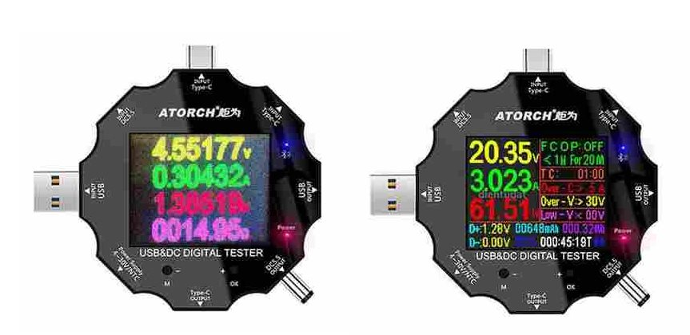
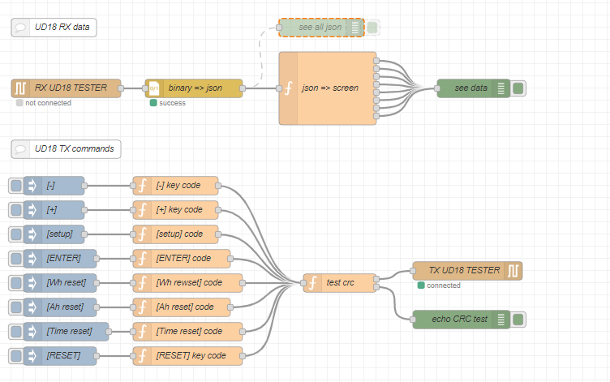

This low price device (13.88 €) is more than just a digital USB tester (see ATORCH UD18: [https://it.aliexpress.com/item/4000001021645.html](https://it.aliexpress.com/item/4000001021645.html) or [https://www.banggood.com/UD18-USB3_0DCType-C-18-in-1-USB-Tester-APP-DC-Digital-Voltmeter-Ammeter-HD-Color-Screen-6-Bit-High-Precision-Display-UD18-Bluetooth-Digital-Meter-p-1564949.html](https://www.banggood.com/UD18-USB3_0DCType-C-18-in-1-USB-Tester-APP-DC-Digital-Voltmeter-Ammeter-HD-Color-Screen-6-Bit-High-Precision-Display-UD18-Bluetooth-Digital-Meter-p-1564949.html) ).

The measures that UD18 can carry out are:

- Tension: 3.6...32 V
- Current: 0...5.1 A
- Power: 0...163.99 W
- Equivalent resistance: 0...999.99 Ω

Furthermore:

- Time: 0...999 ore 
- Capacity: 0...99999 mAh (cumulative)
- Charge: 0...999.99 Wh (cumulative)
- USB-data+: 0...2,99 V
- USB-data-: 0...2.99 V

UD18 as also the capability to cut off the charge (FCOP) when some trigger conditions are meets.

UD18 can communicate via Bluetooth and two applications can be downloaded, one for PC and another App for smartphone. 

To use UD18 in **node-red** custom integrate projects we need:

- the *communication protocol* used by the device (see **UD18_protocool.txt**)
- **node-red** nodes to code+send cammands and receive+decode data (see **U18flow.json**).

For the full story see **D18_01_en.pdf** (in italiano: **UD18_01_it.pdf**).
